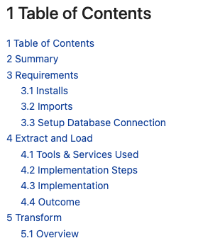

# Automatic Table of Contents (TOC) and Headings Enumeration

This script will automatically enumerate headings in an html file and create a table of contents (TOC) with links to the headings.

It can be injected directly into the browser console. 



## Usage
This process was specifically created for the course NoSQL Lab with Python & MongoDB at the University of Applied Sciences Lucerne.

1) In Jupyter Notebook, add the following html-Tag where you want your Table of Contents (TOC) to appear.

```
<h2>Table of Contents</h2>
<div id="toc-to-fill"> 

</div>
```

2) Export your Jupyter Notebook to html.
3) Open the html file in a browser.

4) Press F12 or right-click and select "Inspect Element" to open the developer tools.
5) Open the console tab.
6) Copy the code from [toc.js](toc.js) and paste it into the console.
7) Press Enter.
8) The TOC should now be filled with links to the headings in your document.
9) Print the page to PDF.

**Important:** The script only works with headings from level 2 to level 6. Level 1 headings will be ignored.

Feel free to change the script according to your needs.
